# OrchidRec

[](https://github.com/appleweiping/OrchidRec/actions/workflows/ci.yml)
[](https://github.com/appleweiping/OrchidRec/actions/workflows/codeql.yml)
[](https://www.python.org/)
[](LICENSE)

OrchidRec is a compact, independent toolkit for reproducible offline
recommendation experiments. It runs on Python 3.11 or newer and has **no
runtime dependencies outside the Python standard library**.

It is intentionally inspectable while providing a complete experimental path:
strict interaction validation, local MovieLens adapters, content fingerprints,
deterministic ID mapping, three train/test split strategies, three
recommenders, six ranking metrics, user bootstrap intervals, paired model
comparisons, portable JSON model state, and JSON/CSV/standalone-HTML reports.

## Quick start

```bash
python -m pip install -e .
orchidrec demo --output-dir artifacts/demo
orchidrec inspect artifacts/demo/model.json
orchidrec recommend artifacts/demo/model.json u1 --k 3
```

The demo writes its input data, experiment configuration, fitted
model, and evaluation report into one directory. To run the checked-in
example instead:

```bash
orchidrec run examples/config.json
```

To exercise the shared-split benchmark runner on the checked-in synthetic
example:

```bash
orchidrec benchmark examples/benchmark_config.json --output-dir artifacts/benchmark
```

Open `artifacts/benchmark/benchmark.html` directly in a browser; it has no
external scripts, fonts, or network requests.

## Real MovieLens benchmark

OrchidRec does not download or redistribute MovieLens. Download either
MovieLens 100K or MovieLens 1M from the official
[GroupLens dataset page](https://grouplens.org/datasets/movielens/) yourself,
read its license/readme, and extract it locally. The adapters accept either the
ratings file or its containing directory:

```bash
orchidrec dataset-summary /datasets/ml-100k --format movielens-100k --minimum-rating 4
orchidrec dataset-summary /datasets/ml-1m --format movielens-1m --minimum-rating 4
```

The 100K adapter reads `u.data` (`user<TAB>item<TAB>rating<TAB>timestamp`);
the 1M adapter reads `ratings.dat` (`user::item::rating::timestamp`). Parsing
is strict: malformed fields, out-of-range ratings, duplicate user-item rows,
blank records, and non-ASCII ratings data fail with a line-specific error.
Ratings at or above the configured threshold become unit-valued positive
events; ratings below it are counted as dropped, not interpreted as explicit
negatives.

Create `movielens-benchmark.json`:

```json
{
  "schema_version": 1,
  "seed": 2026,
  "data": {
    "path": "/datasets/ml-100k",
    "format": "movielens-100k",
    "minimum_rating": 4
  },
  "split": {"method": "leave_one_out", "test_ratio": 0.2},
  "evaluation": {
    "k": 10,
    "exclude_seen": true,
    "bootstrap_samples": 1000,
    "confidence": 0.95
  },
  "models": [
    {"label": "popularity", "name": "popularity", "params": {"weighted": false}},
    {"label": "item-knn", "name": "item_knn", "params": {"neighbors": 40, "shrinkage": 10.0}},
    {"label": "bpr-mf", "name": "implicit_mf", "params": {"factors": 16, "epochs": 5}}
  ]
}
```

Then run:

```bash
orchidrec benchmark movielens-benchmark.json --output-dir artifacts/ml-100k
```

The output directory contains:

- `benchmark.json`: the complete versioned result, effective model parameters,
  dataset/split/config SHA-256 fingerprints, timings, intervals, and pairwise
  statistics;
- `benchmark.csv`: tidy rows suitable for a spreadsheet or downstream
  analysis; and
- `benchmark.html`: an offline dashboard showing estimates, uncertainty, and
  every pairwise comparison.

Absolute data paths are deliberately excluded from the semantic configuration
fingerprint. Identical bytes at two locations therefore identify the same
experiment. The report retains only the source filename, byte hash, normalized
interaction hash, counts, rating range, and timestamp range.

## Architecture

```mermaid
flowchart LR
    A[JSON or local MovieLens ratings] --> B[Strict adapter and immutable dataset]
    B --> B2[Source and normalized SHA-256]
    B --> C[Stable user and item ID maps]
    C --> D{Outer split strategy}
    D -->|random| E[Development / test]
    D -->|temporal| E
    D -->|leave-one-out| E
    E --> N{Optional tuning}
    N -->|inner split| O[Training / validation]
    O -->|select only on validation| F[Selected parameters]
    N -->|disabled| F
    F -->|Popularity / ItemKNN / ImplicitMF| P[Refit on development]
    P -->|one final test evaluation| G[Candidate scores]
    G --> H[Seen-item filter and stable Top-K]
    H --> I[Precision Recall NDCG MRR]
    H --> J[Coverage Novelty]
    I --> K[User bootstrap and paired comparisons]
    J --> K
    K --> M[JSON / tidy CSV / standalone HTML]
    P --> L[Versioned JSON model]
```



The modules have deliberately narrow responsibilities:

- `data.py` validates events and maps string/integer IDs to deterministic
  contiguous indices.
- `datasets.py` strictly parses local datasets and records content-addressed
  provenance without downloading data.
- `split.py` partitions events without dropping or duplicating records.
- `models/` owns fitting, scoring, Top-K ranking, cold-start fallback, and
  versioned serialization.
- `metrics.py` evaluates plain recommendation/relevance mappings and can be
  used independently of the models.
- `config.py` parses strict JSON and resolves relative paths from the config
  file location.
- `experiment.py` joins the pieces without adding wall-clock timestamps or
  other nondeterministic report fields.
- `benchmark.py` optionally selects models on a nested validation split, then
  evaluates final refits on one shared outer test split and bootstrap plan.
- `statistics.py` provides deterministic percentile intervals and paired mean
  comparisons independently of the recommender classes.
- `reporting.py` atomically writes strict JSON, tidy CSV, and self-contained
  HTML artifacts.
- `cli.py` exposes the runner and saved models to shell workflows.

## Interaction data

An input file is a JSON array. Each object has two required fields and two
optional fields:

```json
[
  {"user_id": "alice", "item_id": "article-1", "value": 1.0, "timestamp": 1710000000},
  {"user_id": 42, "item_id": 1007, "value": 2.0, "timestamp": 1710000100}
]
```

| Field | Type | Meaning |
| --- | --- | --- |
| `user_id` | non-empty string or integer | Stable user identifier; booleans are rejected. |
| `item_id` | non-empty string or integer | Stable item identifier; integers and numeric strings remain distinct. |
| `value` | finite number greater than zero | Positive implicit-feedback strength; default `1.0`. |
| `timestamp` | finite number or `null` | Ordering value used by temporal splits. |

Unknown fields are rejected. Repeated user-item events are allowed: Popularity
and ItemKNN aggregate their values, while ImplicitMF treats the pair as one
positive preference. A user-item pair is never split across training and test,
so repeated events cannot leak the evaluation target into model fitting.

`StableIdMap` sorts integer IDs numerically before string IDs, which are sorted
lexicographically. The mapping is therefore independent of input row order and
can be serialized without relying on hash iteration order.

## Split strategies

- `random` shuffles user-item groups with a local `random.Random(seed)` and
  chooses the group boundary closest to the requested ratio. Original event
  order is preserved inside both partitions and at least one pair remains on
  each side.
- `temporal` holds out the newest suffix at the closest boundary that does not
  cut a repeated user-item pair. Every event must have a timestamp; input
  position resolves equal timestamps. It fails explicitly if no safe boundary
  exists.
- `leave_one_out` selects each multi-item user's latest item and holds out all
  events for that item. If any event for that user lacks a timestamp, original
  input order is the stable fallback. Users with only one distinct item stay
  in training.

Random and temporal splits use `test_ratio`. Leave-one-out ignores the ratio.

## Models

### Popularity

Ranks by summed event values (`weighted: true`) or event count. It is a useful
sanity baseline and also supplies cold-start rankings to the personalized
models.

### ItemKNN

Builds weighted user vectors, computes cosine similarities for co-observed
items, adds non-negative shrinkage to the cosine denominator, and retains the
strongest configured neighbors per item. A known user's score is a
similarity-weighted history sum. Unknown users receive the popularity fallback.

Training cost is approximately `sum_u |history(u)|²`; this implementation is
designed for learning and small/medium experiments rather than large catalogs.

### ImplicitMF

Learns user and item latent factors with Bayesian Personalized Ranking (BPR):
each positive user-item pair is contrasted with seeded negative samples, then
updated by pairwise stochastic gradient descent. Users who have seen every
catalog item are skipped safely during negative sampling. Unknown users receive
the popularity fallback.

Training cost is roughly
`epochs × positives × negative_samples × factors`. All initialization,
shuffling, and negative sampling use a model-local seeded generator.

## Top-K behavior

All models share the same ranking implementation:

1. validate that candidates belong to the fitted catalog;
2. compute finite scores;
3. remove already-seen items by default;
4. sort by descending score, then stable item ID;
5. return one-based `Recommendation(item_id, score, rank)` objects.

Pass `exclude_seen=False` in Python or `--include-seen` to the CLI when a
diagnostic needs the full catalog.

## Metrics

Metrics are macro-averaged across users with at least one relevant test item.
Test interactions for items absent from the training catalog are counted as
`cold_start_test_interactions` in the report and excluded from ranking metrics;
the models cannot score an item they have never fitted. The evaluated and raw
test sizes are both reported, and an all-cold-start test set is rejected.

- **Precision@K**: relevant recommendations divided by `K`; short lists are
  not given a smaller denominator.
- **Recall@K**: recovered relevant items divided by all relevant test items.
- **NDCG@K**: binary discounted gain normalized by the ideal ranking.
- **MRR@K**: reciprocal rank of the first relevant item.
- **Coverage@K**: fraction of the training catalog exposed across all lists.
- **Novelty@K**: mean `-log2(p(item))`, with Laplace-smoothed training event
  frequencies so unseen catalog items have a finite value.

Duplicate items anywhere in a ranking, invalid ID types, duplicate catalog
entries, and recommendations outside the declared catalog are validation
errors instead of being silently counted—even when the invalid entry appears
beyond the requested cutoff.

### Exposure-corrected metrics (optional)

The metrics above count a hit whenever a recommended item appears in the
holdout. That treats the holdout as a random sample of relevance, which it is
not: it is what a previous system chose to show, and previous systems show
popular items far more often. A popularity ranker therefore scores well partly
for agreeing with whatever produced the log.

Declaring an exposure model asks for a second set of metrics that weight each
observed interaction by the inverse of its propensity, so a rarely-exposed item
counts for more when it does appear:

```json
"evaluation": {"k": 10, "exposure": {"exponent": 0.75, "minimum": 0.01}}
```

`exponent` says how strongly popularity is believed to drive exposure. At `0`
every item is equally likely to be observed and the correction is the identity,
which is the honest way to state "no exposure model"; at `1` propensity is taken
to be proportional to popularity. The default follows Yang et al., *Unbiased
Offline Recommender Evaluation for Missing-Not-At-Random Implicit Feedback*
(RecSys 2018), which takes `p` proportional to `n ** ((eta + 1) / 2)` at
`eta = 0.5`. Propensities are estimated from **training** popularity only;
estimating them from the holdout would let it explain its own sampling.

`minimum` is a floor on the propensity. Inverse weights are otherwise unbounded,
so one barely-exposed item can dominate an estimate; the floor trades a bounded
bias for a bounded variance, and the report says how many observations sat on
it.

Two properties make the corrected numbers reviewable rather than merely
different. They are normalized over the whole population rather than per user,
because a per-user ratio cannot correct anything: for a user with a single
observed interaction it is `w / w` on a hit and `0 / w` on a miss, so the weight
cancels exactly — and strong exposure bias is precisely the regime where most
users have one observed interaction. They therefore estimate a *micro*-averaged
quantity, an average over interactions, while the metrics above average over
users; the two differ even with no correction at all, so evaluate under
`uniform_exposure` to get the like-for-like uncorrected baseline.

Every corrected report carries `effective_sample_size`, the Kish effective
sample size of its weights as a fraction of the observations. Inverse weighting
concentrates an estimate on rarely-observed items, and an estimate resting on a
few heavily weighted observations is not more trustworthy than the biased one it
replaced — it is differently untrustworthy. A value near `1` means the weights
are nearly uniform; a small value means a handful of observations decide the
answer.

The section appears in the report only for a run that configured an exposure
model, so a configuration that does not ask for one keeps exactly the report it
produced before.

### Uncertainty and paired comparisons

The benchmark runner resamples evaluated users with replacement using a local
seeded generator. For every resample it recomputes all six aggregates,
including the union-based catalog coverage and recommendation-weighted
novelty. The JSON report records percentile confidence intervals around each
point estimate.

Every model pair uses the same resampled user indices. Differences are
reported as `right - left`, together with their percentile interval, the
bootstrap probability that the right model is better, and a finite-sample
corrected exploratory two-sided p-value. These values quantify uncertainty in
this particular offline sample; they are not a substitute for multiple-test
correction, online experiments, or a causal claim.

### Leakage-safe hyperparameter selection

The benchmark configuration can opt into a finite, explicit Cartesian-product
grid. The outer split is made first and its test partition is sealed. OrchidRec
then splits only the outer training partition into inner training and
validation partitions, selects each model using validation results, refits the
selected parameters on the complete outer training partition (training plus
validation), and evaluates that final fit on the test partition exactly once.
The following is the `tuning` and `models` portion of a benchmark configuration;
the required schema, data, outer split, and evaluation fields remain as shown
in the complete MovieLens example above.

```json
{
  "tuning": {
    "selection_metric": "ndcg",
    "direction": "maximize",
    "validation_split": {
      "method": "leave_one_out",
      "validation_ratio": 0.2
    },
    "implicit_mf_seeds": [2026, 2027, 2028]
  },
  "models": [
    {
      "label": "popularity",
      "name": "popularity",
      "grid": {"weighted": [false, true]}
    },
    {
      "label": "item-knn",
      "name": "item_knn",
      "grid": {"neighbors": [20, 40], "shrinkage": [0.0, 10.0]}
    },
    {
      "label": "bpr-mf",
      "name": "implicit_mf",
      "params": {"negative_samples": 1},
      "grid": {"factors": [8, 16], "epochs": [5, 10]}
    }
  ]
}
```

`params` are fixed values and `grid` contains the values to search; the same
parameter cannot occur in both. A tuning configuration requires at least one
model grid, and each grid expands to at most 128 candidates. A model without a
grid participates as one fixed candidate, which is useful for untuned baselines.
Candidate order is canonical by parameter name, while value-array order breaks
equal-score ties deterministically. All six metrics can be selected; `direction`
accepts `maximize` or `minimize` and defaults to `maximize` when omitted.
As with the outer split, `validation_ratio` is validated but ignored by
`leave_one_out`.

Popularity and ItemKNN are deterministic and therefore run once per candidate.
ImplicitMF runs every candidate once for each distinct
`implicit_mf_seeds` value and selection uses the arithmetic mean of that
validation metric; one to sixteen unique integer seeds are accepted. Those
seeds are validation repeats only. Model-level
`implicit_mf.seed` is rejected when tuning is active; the final refit always
uses the benchmark's top-level `seed`, making the single final test evaluation
unambiguous. Tuning timings are observational, just like final benchmark
timings.

The JSON report records the exact search space, every candidate and trial,
effective parameters, all validation metrics, trial timing, selected score and
final parameters. It also records SHA-256 fingerprints for the source and
normalized data, semantic configuration, development/training/validation/test
partitions, outer split, and combined three-way split. The tuned CSV adds
candidate and trial rows, and the standalone HTML adds the selection table.
If `tuning` and model `grid` fields are absent, configuration normalization,
execution, and report shape remain unchanged.

## Experiment configuration

```json
{
  "seed": 2026,
  "data": {"path": "interactions.json"},
  "split": {"method": "leave_one_out", "test_ratio": 0.2},
  "model": {
    "name": "item_knn",
    "params": {"neighbors": 40, "shrinkage": 10.0}
  },
  "evaluation": {"k": 10, "exclude_seen": true, "exposure": null},
  "output": {
    "model_path": "artifacts/model.json",
    "report_path": "artifacts/report.json"
  }
}
```

Paths are relative to the configuration file, not the caller's current
directory. Unknown sections, keys, model names, parameters, and invalid numeric
values fail early. Supported model parameters are:

| Model | Parameters |
| --- | --- |
| `popularity` | `weighted` |
| `item_knn` | `neighbors`, `shrinkage` |
| `implicit_mf` | `factors`, `epochs`, `learning_rate`, `regularization`, `negative_samples`, `seed` |

When `implicit_mf.seed` is absent, the experiment-level seed is used.

## CLI

```text
orchidrec run CONFIG
orchidrec demo [--output-dir DIRECTORY]
orchidrec inspect MODEL
orchidrec recommend MODEL USER_ID [--k K] [--include-seen]
orchidrec dataset-summary DATA --format FORMAT [--minimum-rating RATING]
orchidrec benchmark CONFIG [--output-dir DIRECTORY]
```

`USER_ID` accepts a JSON scalar. `42` is an integer ID, `"42"` is a string ID,
and a plain non-JSON token such as `alice` is treated as a string. Expected
data/config/model errors are printed to standard error with exit code `2`.

## Python API

```python
from orchidrec import Interaction, InteractionDataset, ItemKNN

events = InteractionDataset(
    [
        Interaction("u1", "a"),
        Interaction("u1", "b"),
        Interaction("u2", "a"),
        Interaction("u2", "c"),
    ]
)

model = ItemKNN(neighbors=10, shrinkage=1.0).fit(events)
for recommendation in model.recommend("u1", k=5):
    print(recommendation.rank, recommendation.item_id, recommendation.score)
```

For portable persistence:

```python
from orchidrec.models import load_model, save_model

save_model(model, "model.json")
restored = load_model("model.json")
```

The JSON envelope records a format marker, schema version, model type,
hyperparameters, catalog, seen-item state, and fitted numeric state. Loading is
strict: unknown fields, invalid IDs, bad dimensions, non-finite numbers, and an
unsupported version are rejected. It does not execute serialized code.

For a programmatic real-data benchmark:

```python
from orchidrec import load_benchmark_config, run_benchmark
from orchidrec.reporting import save_benchmark_reports

config = load_benchmark_config("movielens-benchmark.json")
result = run_benchmark(config)
paths = save_benchmark_reports(result, "artifacts/ml-100k")
print(result.dataset.interactions_sha256, paths.html_path)
```

## Reproducibility contract

For the same validated input order, configuration, and supported Python
runtime, OrchidRec guarantees deterministic partitions, ID maps, model-local
sampling, bootstrap resamples, tie-breaking, fingerprints, metric estimates,
and serialized key/order layout. Floating-point values can still differ at the
final bits across unusual hardware or Python math implementations; comparisons
across platforms should use tolerances.

The single-model runner deliberately excludes elapsed time, current time, host
names, and random run IDs. The benchmark runner records measured fit and
recommendation seconds because performance comparison requires them; timings
are observational and are the only intentionally nondeterministic result
fields. Neither runner changes Python's process-global random state.

## Scope and limitations

- Data and model state are held in memory; the adapters are not streaming ETL.
- Feedback is positive/implicit; zero and negative values are rejected.
- MovieLens rating thresholding discards lower ratings rather than learning
  from them, and this toolkit does not predict explicit star ratings.
- ItemKNN uses dense per-user pair enumeration and ImplicitMF uses simple SGD,
  not optimized native kernels. Full MovieLens 1M runs can therefore be slow.
- There is no feature store, distributed execution, or online serving layer.
- Hyperparameter search is deliberately limited to explicit finite grids; it
  does not implement adaptive, Bayesian, distributed, or test-informed search.
- Offline holdout metrics assume unobserved items are candidates. Exposure and
  selection bias are corrected only when a run declares an exposure model, and
  then only as well as that model describes the logging policy that produced the
  data: inverse weighting moves an estimate, and a wrong model moves it
  somewhere else rather than failing loudly. The reported effective sample size
  says how few observations the corrected number rests on. Bootstrap intervals
  treat users as the resampling unit and do not model temporal or social
  dependence.
- Recorded wall-clock timing depends on the host, Python build, background
  load, and filesystem cache. Compare timing only under a controlled protocol.
- Saved JSON models can be large. Validate file provenance and apply ordinary
  resource limits when loading untrusted inputs.

These boundaries keep the implementation inspectable and dependency-free.

## Development

```bash
python -m pip install -e ".[dev]"
ruff check src tests examples
mypy src
python -m unittest discover -s tests -v
coverage run -m unittest discover -s tests && coverage report
python -m compileall -q src tests examples
orchidrec demo --output-dir artifacts/smoke
orchidrec benchmark examples/benchmark_config.json --output-dir artifacts/benchmark-smoke
python -m build
```

The test suite covers validation failures, deterministic splitting and
training, ranking semantics, all metrics, strict configuration, serialization
tampering, MovieLens format failures, content hashes, deterministic bootstrap
statistics, paired comparisons, portable report formats, CLI exit behavior,
and end-to-end runs for every included model.
See [CONTRIBUTING.md](CONTRIBUTING.md) before proposing changes and
[the release process](docs/releasing.md) for clean-install, SBOM, checksum,
and build-provenance guarantees.

## Algorithm reference

OrchidRec's implementation and public interfaces are independent. The
`ImplicitMF` pairwise objective follows Rendle et al., “BPR: Bayesian
Personalized Ranking from Implicit Feedback” (UAI 2009, arXiv:1205.2618).
The citation identifies the published algorithm; no external project code is
included.

## License

OrchidRec is available under the [MIT License](LICENSE).
See [CONTRIBUTING.md](CONTRIBUTING.md), [SECURITY.md](SECURITY.md), and [CHANGELOG.md](CHANGELOG.md) for project policies and release history.
